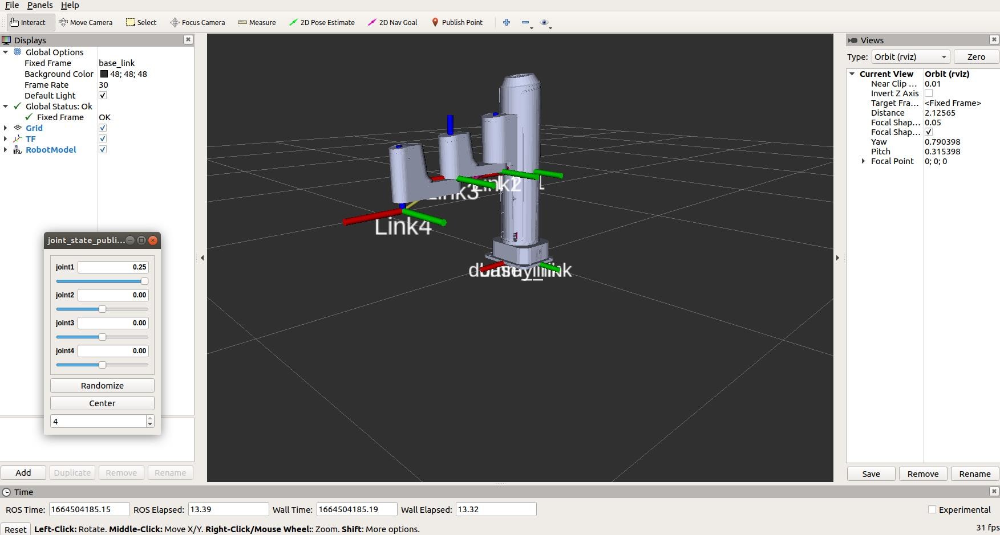

# <center>M1 Pro Robot</center>

# 1. 源码编译
## 下载源码
```sh
cd $HOME/catkin_ws/src

git clone https://github.com/Dobot-Arm/M1Pro_ROS.git

cd $HOME/catkin_ws
```
## 编译
```sh
catkin_make
```
## 设置环境变量
```sh
source $HOME/catkin_ws/devel/setup.bash
```

# 3. 示例演示

## 在仿真环境下使用

1. ## rviz 显示
    ```sh
    roslaunch m1pro_description display.launch
    ```

   可通过 joint_state_publisher 调节各关节的角度，在 rviz 上看到其显示效果

   

## 4. 控制真实机械臂

* **使用如下命令连接机械臂, robot_ip 为实际机械臂所对应的IP地址**
    ```sh
    roslaunch bringup_m1pro bringup.launch robot_ip:=192.168.1.6
    ```

# 自定义功能开发

    bringup 中定义了 msg 和 srv，用户可通过这些底层 msg 和 srv 实现对机械臂的控制
